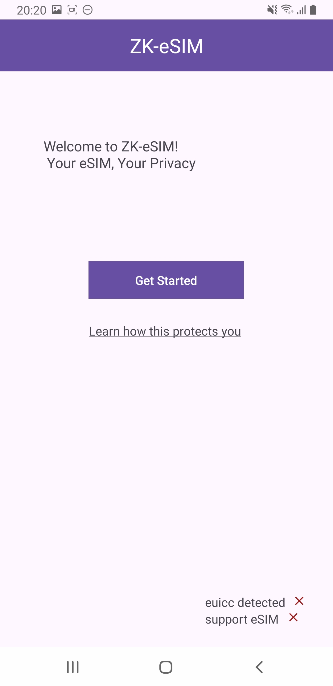
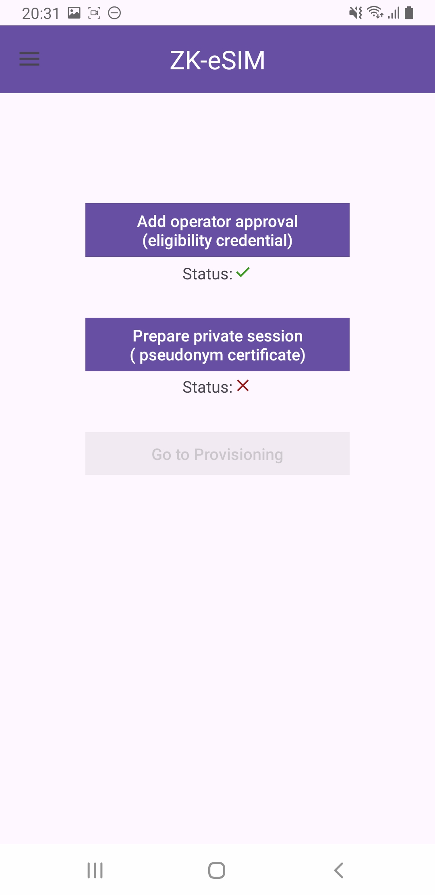
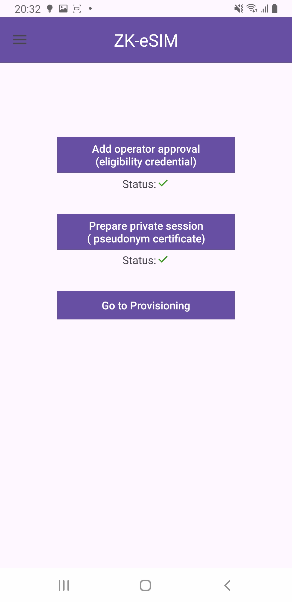
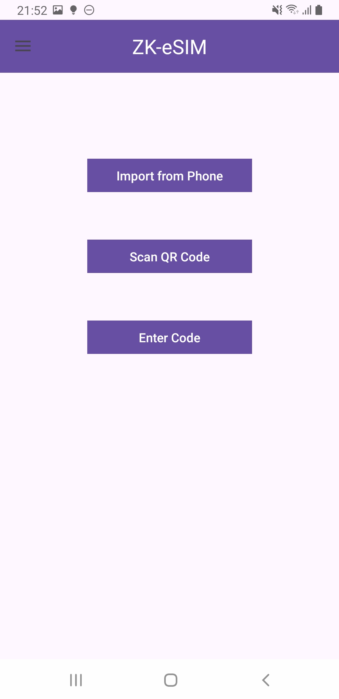
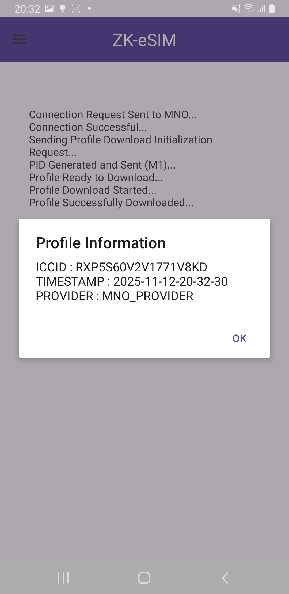
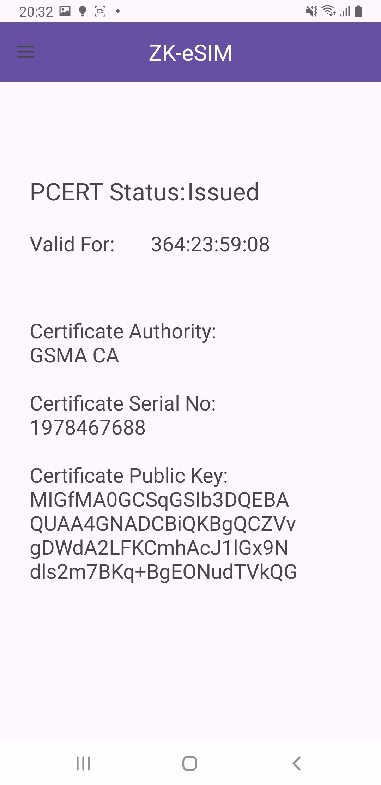

# Zk-eSIM Android Application Overview

This repository provides an overview of the Android Application implementation for the Zk-eSIM scheme. Specifically this repository provides a step-by-step process that the user will undertake when using the application. For a video walkthrough of the app, see [App walkthrough](App-walkthrough.mp4) file.

---
## 1. Home Page Activity

  

This view shows the Home Page displayed to the user after opening the App. The **"Get Started"** option allows the user to progress further into the application to setup their anonymous credential and install the certificate from the PCA. Additionally a link is provided that links the user to a page where they can learn more about how ZK-eSIM improves their privacy. 

Lastly the status values in the bottom right of the screen inform the user if their phone is compatible with eSIM technology (ie does their phone have the embedded universal integrated circuit card) and whether they are able to install an eSIM profile. 

(**Note:** In this case we can see that the phone is incompatible with eSIM technology, denoted by the crosses - at the moment this will have no impact on the user's ability to use the App as it is designed to provide a graphical interface for the protocol and not as a full implementation with eSIM profile installation)

--- 
## 2. Setup Page

  
  

After the user clicks the **"Get Started"** button, they are taken to the main setup page, where they are presented with the options to add operator approval (setup the their anonymous credential), prepare private session (install the pseudonym certificate), or if the previous two steps have been complete, go to the profile provisioning activtiy. The status of the activities required to access the provisioning page are denoted below the relevant button. 

The image on the left demonstrates the situation where the user hasn't completed the required activities to proceed to profile provisioning, whereas, the image on the right displays the setup screen once the prerequisite activities have been completed.

---
## 3. Import and Credential Registration Options

  

When the user selects either the **"Add operator approval"** or **"Prepare private session"** options in the setup page, the import options page is opened (see image above), where the user is given three possible options for setting up the anonymous credential or pseudonym certificate.

Import from Phone, directly connects the user to the MNO java server where the MNO automatically assigns the credentail (for the first option) or for the certificate, the MNO (acting as the PCA in this instance) sends the certificate to the phone to be stored and used later. 

Scan QR Code generates a QR code containing the corresponding information, presented on the device running the MNO Java class, that the user can then scan (the app opens a QR code scanner activity) to receive the information (credential value, or certificate information)

Lastly, the user can enter a code, assumed to have been sent to them by the operator (but for the purpose of this impelementation 
is a hard-coded value), that is sent to the MNO to validate (ie code is equal to the value stored by the MNO), and then the credential / certificate is sent directly to the UE.

---
## 4. Profile Provisioning

  

Once the user has complete all of the prerequisite steps to allow for profile provisioning, they can proceed to the page displayed above. When the user enters this acitivity, the app automatically connects to the MNO java server, and begins the provisioning process. Each stage of the provisioning process is displayed in the screenshot above (and displayed in the app as they occur). 

Once provisioning has finished, an alertbox displays on the screen showing the information contained within the profile to the user. 

---
## 5. Certificate Information

  

The above activity in not directly related to the activities of the application but instead allows the user to view the information about the installed pseudonym certificate. This is accessed via the hamburger menu (available from all pages except from the home page shown at app startup).
